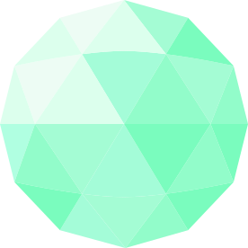

# Radiojade

## Features

- builds on [Speakeasy](https://github.com/foundpatterns/speakeasy)'s [Lighttouch application framework](https://github.com/foundpatterns/lighttouch), a progressive, [no-code development platform](https://en.wikipedia.org/wiki/No-code_development_platform) ([rapid application development](https://en.wikipedia.org/wiki/Rapid_application_development) environment) with powerful encryption tools
- [secure by default](https://www.privateinternetaccess.com/blog/2017/08/libsodium-v1-0-12-and-v1-0-13-security-assessment/#section_1)
- [Safe Systems Programming with Rust | Mozilla ♥ Rust](https://www.youtube.com/watch?v=P3sfNGtpuxc)
- run it on Google Cloud Platform, the open source cloud
- low overhead (you can use a simple hardware infrastructure with a small footprint)

## Jade

- your identity, in your hands. (no usernames and passwords, 2 factor SMS, etc)
- you don't need to pay anyone for a certificate
- there's nothing to rent, no one to ask before changing anything
- you and your community can build a network of trusted partners

## Witness

- stand by your word
- help friends uphold their pacts (compact, agreement)
- take vows that seal bonds to higher causes
- promise and compromise at will for a better world

## Some History

- [Is anybody using client browser certificates?](https://security.stackexchange.com/questions/1430/is-anybody-using-client-browser-certificates)
- [Why King George III Can Encrypt](https://freedom-to-tinker.com/2014/06/06/why-king-george-iii-can-encrypt/)
- [Why Johnny Still, Still Can't Encrypt](https://arxiv.org/abs/1510.08555)
- [Why Johnny Can't Encrypt](https://www.usenix.org/conference/8th-usenix-security-symposium/why-johnny-cant-encrypt-usability-evaluation-pgp-50)
- [A Cypherpunk's Manifesto](https://www.activism.net/cypherpunk/manifesto.html)
- [Chinese Imperial Jade/Ivory Seals](https://www.pinterest.com/kcl101/chinese-imperial-jadeivory-seals/)

#getjaded
